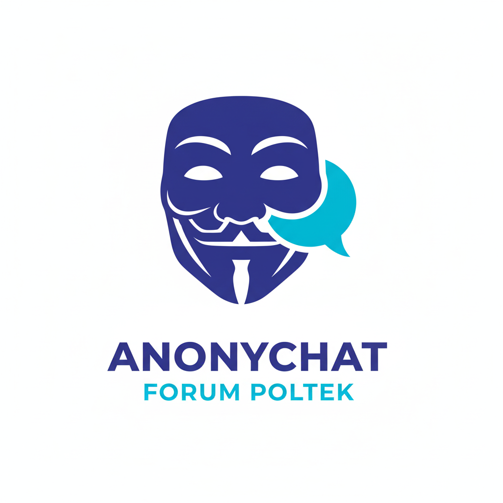

# 💬 Forum Chat - Frontend

Selamat datang di repositori frontend untuk aplikasi **Forum Chat**. Proyek ini dibangun untuk menyediakan antarmuka pengguna yang interaktif, responsif, dan kaya fitur untuk platform obrolan forum real-time. Dibangun dengan React, aplikasi ini menawarkan pengalaman pengguna yang modern dan mulus.

<div align="center">
  
</div>

<div align="center">
  
[](https://github.com/Zulkifli1409/forum-chat-frontend)
[](https://github.com/Zulkifli1409/forum-chat-backend)

</div>

---

## 📜 Daftar Isi

- [✨ Fitur Utama](#-fitur-utama)
- [🚀 Teknologi yang Digunakan](#-teknologi-yang-digunakan)
- [📁 Struktur Proyek](#-struktur-proyek)
- [🏁 Memulai](#-memulai)
  - [Prasyarat](#prasyarat)
  - [Instalasi](#instalasi)
  - [Menjalankan Aplikasi](#menjalankan-aplikasi)
- [📜 Skrip yang Tersedia](#-skrip-yang-tersedia)
- [🔗 Link Terkait](#-link-terkait)

---

## ✨ Fitur Utama

- 💬 **Obrolan Grup Real-Time** — Berkomunikasi secara instan dengan pengguna lain di ruang obrolan publik
- 🔒 **Pesan Pribadi** — Kirim pesan langsung ke pengguna admin secara aman
- 📱 **Antarmuka Pengguna Responsif** — Desain yang dioptimalkan untuk berbagai ukuran layar, dari desktop hingga perangkat seluler
- 👨‍💼 **Dasbor Admin** — Panel admin yang kuat untuk mengelola pengguna, obrolan, laporan, dan melihat analitik
- 📊 **Visualisasi Data** — Grafik dan bagan interaktif yang didukung oleh Chart.js untuk analitik penggunaan
- 🔔 **Sistem Notifikasi** — Pemberitahuan real-time untuk pesan baru dan pembaruan penting lainnya
- 🔐 **Autentikasi Aman** — Proses masuk dan pendaftaran yang aman menggunakan token JWT
- 📢 **Manajemen Iklan dan Pengumuman** — Fitur bagi admin untuk mempublikasikan pengumuman dan mengelola slot iklan

---

## 🚀 Teknologi yang Digunakan

Proyek ini dibangun menggunakan teknologi modern berikut:

| Teknologi | Versi | Deskripsi |
|-----------|-------|-----------|
| **React** | 19.1.1 | Library JavaScript untuk membangun antarmuka pengguna |
| **React Router** | 7.8.2 | Routing sisi klien dan navigasi |
| **Axios** | 1.11.0 | Klien HTTP berbasis Promise untuk membuat permintaan ke backend |
| **Socket.io-client** | 4.8.1 | Komunikasi WebSocket real-time dengan server |
| **Tailwind CSS** | 3.4.17 | Kerangka kerja CSS utility-first untuk styling yang cepat dan kustom |
| **Chart.js** | 4.5.0 | Membuat bagan dan visualisasi data yang indah |
| **react-chartjs-2** | 5.3.0 | Wrapper React untuk Chart.js |
| **Lucide React** | 0.542.0 | Pustaka ikon yang bersih dan konsisten |
| **js-cookie** | 3.0.5 | Menangani cookie di sisi klien |

---

## 📁 Struktur Proyek

Struktur direktori proyek diatur sebagai berikut untuk skalabilitas dan kemudahan pemeliharaan:

```
/src
├── /components      # Komponen React yang dapat digunakan kembali (Navbar, ChatBox, dll.)
├── /context         # Konteks React untuk manajemen state global (AuthContext, ThemeContext)
├── /pages           # Komponen utama untuk setiap halaman (Login, Register, Chat, Admin)
├── /services        # Modul untuk berinteraksi dengan API backend (authService, chatService)
├── App.js           # Komponen root aplikasi dan konfigurasi routing
├── index.js         # Titik masuk utama aplikasi
├── index.css        # File CSS global
└── socket.js        # Konfigurasi instance klien Socket.IO
```

---

## 🏁 Memulai

Ikuti langkah-langkah ini untuk menjalankan proyek ini di lingkungan pengembangan lokal Anda.

### Prasyarat

Pastikan Anda telah menginstal:

- **Node.js** (disarankan versi LTS)
- **npm** (atau manajer paket alternatif seperti Yarn)

### Instalasi

1. **Clone repositori:**

   ```bash
   git clone https://github.com/Zulkifli1409/forum-chat-frontend.git
   cd forum-chat-frontend
   ```

2. **Instal semua dependensi proyek:**

   ```bash
   npm install
   ```

3. **Konfigurasi Variabel Lingkungan:**

   Buat file `.env` di direktori root proyek dan tambahkan URL API backend Anda:

   ```env
   REACT_APP_API_URL=http://localhost:5000/api
   ```

### Menjalankan Aplikasi

Setelah instalasi selesai, Anda dapat menjalankan aplikasi menggunakan skrip npm.

- **Untuk memulai server pengembangan:**

  ```bash
  npm start
  ```

  Aplikasi akan secara otomatis terbuka di browser Anda di `http://localhost:3000`. Server pengembangan mendukung hot-reloading, yang berarti perubahan pada kode akan langsung terlihat tanpa perlu me-refresh halaman.

---

## 📜 Skrip yang Tersedia

Dalam `package.json`, Anda akan menemukan beberapa skrip yang telah dikonfigurasi sebelumnya:

| Perintah | Deskripsi |
|----------|-----------|
| `npm start` | Menjalankan aplikasi dalam mode pengembangan |
| `npm run build` | Membuat build aplikasi yang dioptimalkan untuk produksi di dalam direktori `build/` |
| `npm test` | Menjalankan test runner dalam mode interaktif |
| `npm run eject` | ⚠️ Menghapus dependensi build tunggal dari proyek Anda. **Gunakan dengan hati-hati!** |

---

## 🔗 Link Terkait

<div align="center">

| Repository | Link |
|------------|------|
| 🎨 **Frontend** | [Download Frontend](https://github.com/Zulkifli1409/forum-chat-frontend) |
| 🖥️ **Backend** | [Download Backend](https://github.com/Zulkifli1409/forum-chat-backend) |

</div>

---

<div align="center">
  
**Dibuat dengan ❤️ menggunakan React dan Tailwind CSS**

</div>